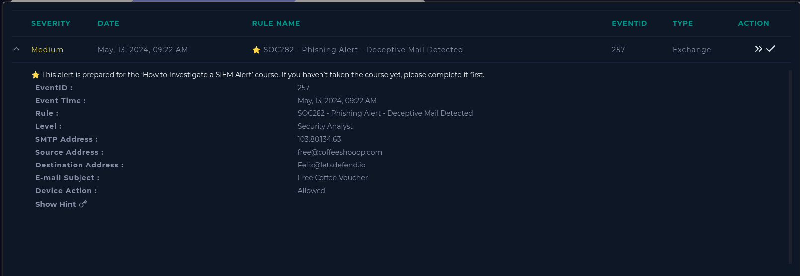
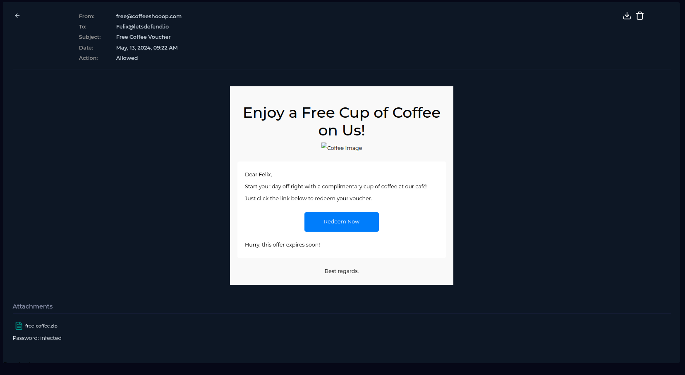
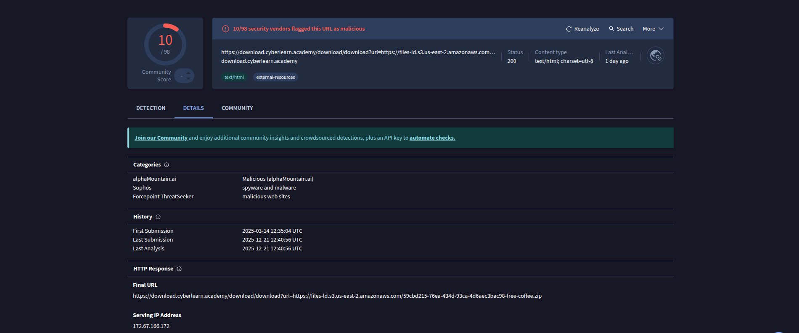
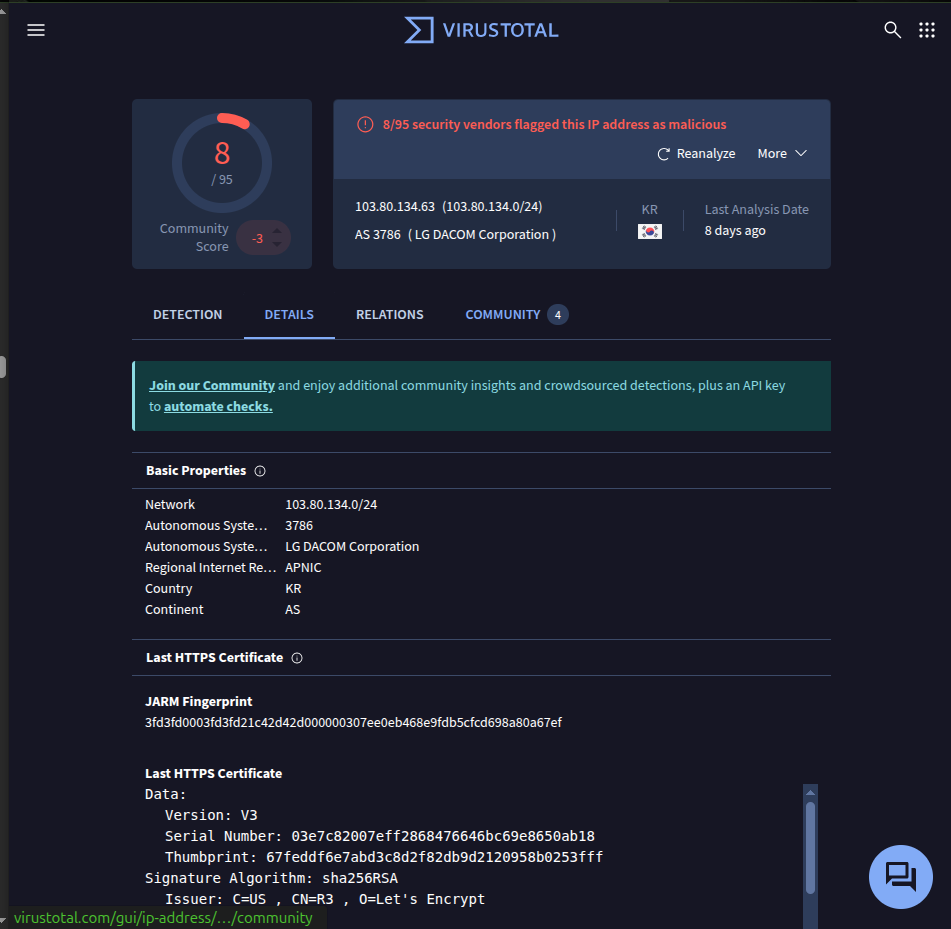
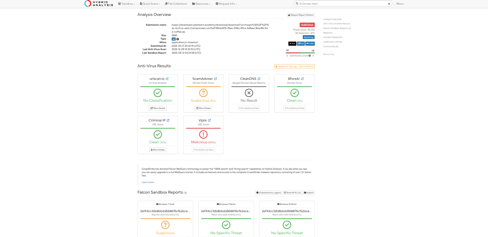
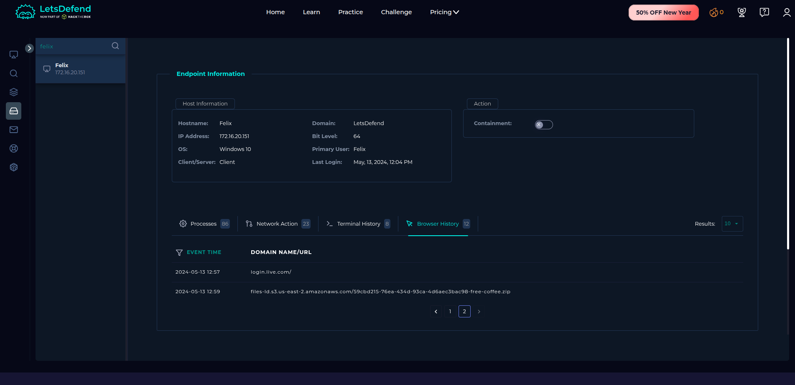
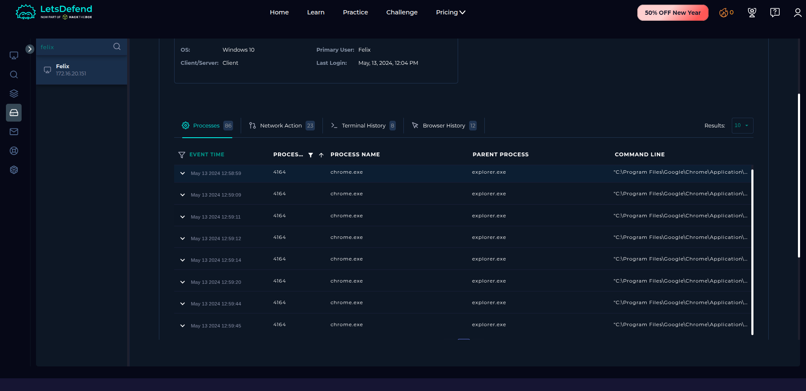
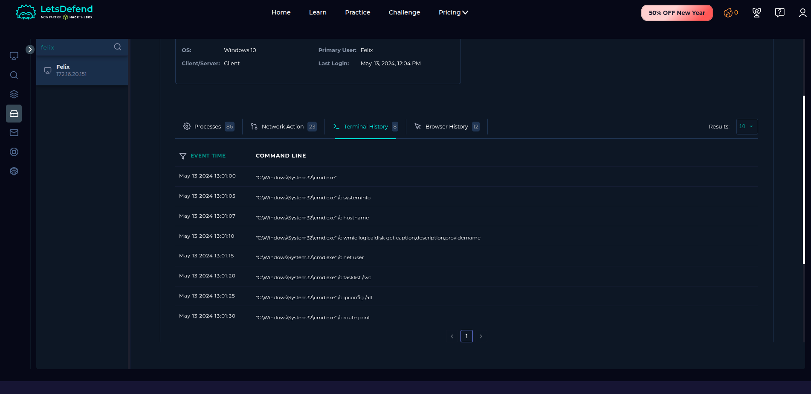
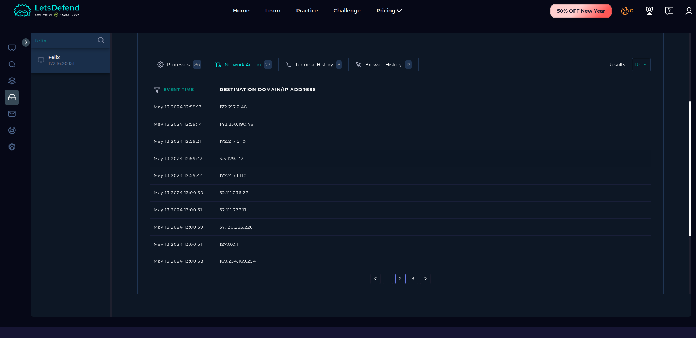
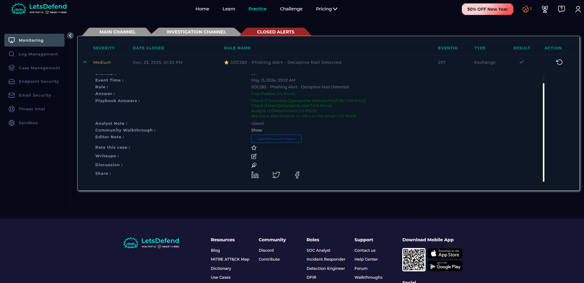

#  Incident 1 – Phishing Alert Investigation

**Platform:** LetsDefend.io  
**Incident ID:** 257  
**Rule Name:** SOC282 – Phishing Alert – Deceptive Mail Detected  
**Severity:** Medium  
**Status:** Closed – True Positive  

---

## 1. Incident Overview

A phishing alert was generated after a deceptive email offering a **“Free Coffee Voucher”** was detected. The investigation confirmed malicious intent through email analysis, URL reputation checks, file analysis, and endpoint activity review.

### 📸 Screenshot  

---

## 2. Alert Metadata

- **Date & Time:** May 13, 2024 – 09:22 AM  
- **Log Source:** Exchange (Email Security)  
- **System Action:** Allowed  
- **Affected User:** Felix  
- **Endpoint OS:** Windows 10 (64-bit)  
- **Host IP:** 172.16.20.151  

---

## 3. Email Analysis

### Email Details
- **From:** free@coffeeshooop.com  
- **To:** Felix@letsdefend.io  
- **Subject:** Free Coffee Voucher  
- **Attachment:** free-coffee.zip  
- **Attachment Password:** infected  

### 📸 Screenshot  

---

## 4. Malicious Artifact Analysis

### 4.1 URL Reputation Analysis (VirusTotal)

- **10 / 98 vendors** flagged the URL as malicious

### 📸 Screenshot

---

### 4.2 IP Reputation Analysis

- **SMTP IP:** 103.80.134.63  
- **8 / 95 vendors** flagged as malicious

### 📸 Screenshot

---

### 4.3 File Analysis (Hybrid Analysis)

- **File Name:** free-coffee.zip  
- **Threat Score:** 55 / 100  
- **Verdict:** Malicious (Phishing)

### 📸 Screenshot

---

## 5. Endpoint Investigation (User: Felix)

### 5.1 Browser History

---

### 5.2 Process Activity

---

### 5.3 Terminal Activity

---

### 5.4 Network Activity

---

## 6. Indicators of Compromise (IOCs)

- **Domain:** coffeeshooop.com  
- **IP:** 103.80.134.63  
- **File:** free-coffee.zip  

---

## 7. Final Verdict

- **True Positive**  
- User interaction confirmed  
- Incident closed successfully  

  **MITRE ATT&CK:** T1566 – Phishing

### 📸 Screenshot

