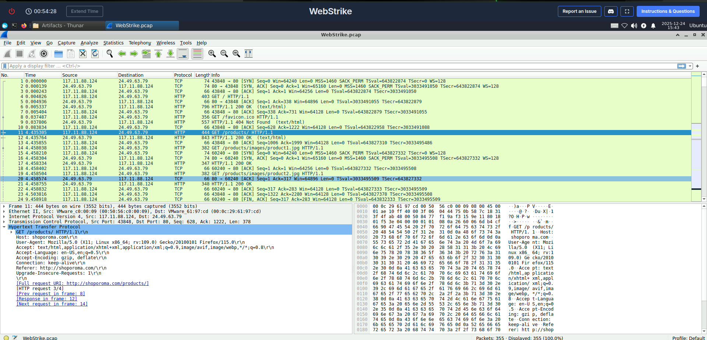
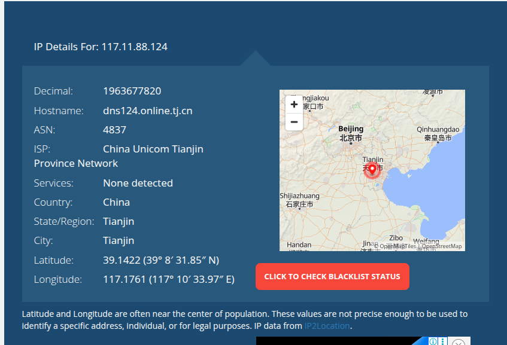
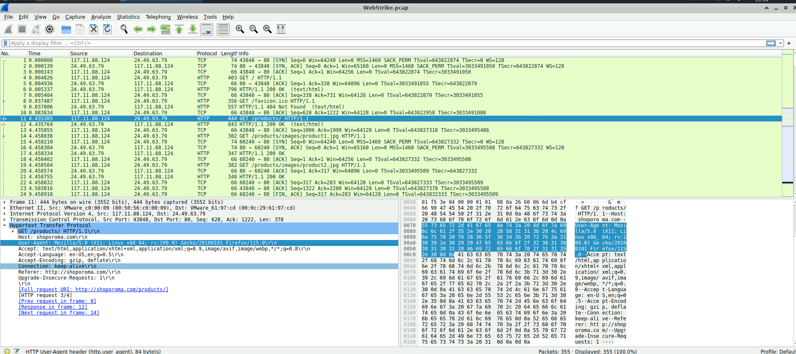
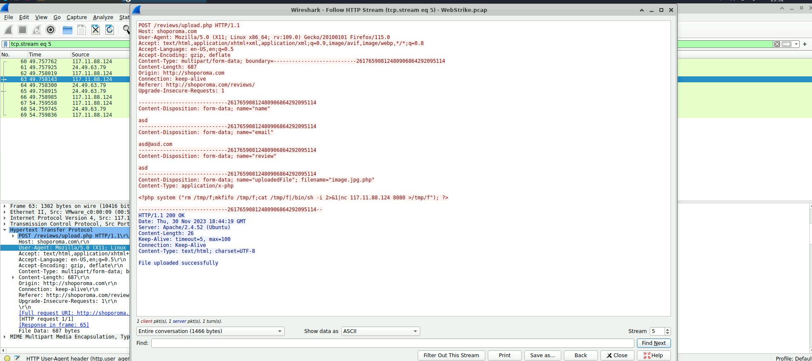
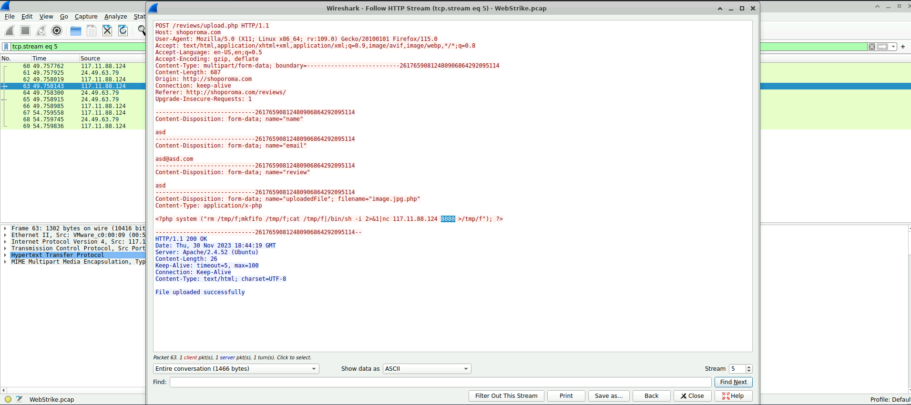
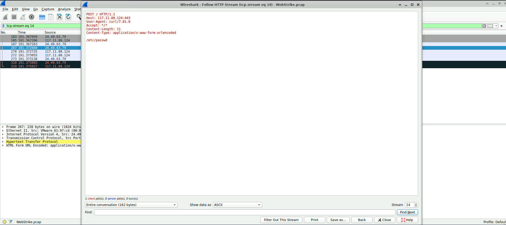

# WebStrike Challenge Report

**Platform:** LetsDefend.io  
**Focus:** WebStrike Challenge (PCAP-Based Investigation)  
**Role:** SOC Analyst (Student / Trainee)  
**Status:** Completed  

---

## a) WebStrike Challenge

---

### i) Challenge Overview and Objectives

The WebStrike challenge simulates a real-world **web application security incident** where a suspicious file was discovered on a company’s web server. The Development team flagged the anomaly, suspecting malicious activity, and escalated the issue to the Security team for investigation.

To determine how the file appeared and assess the extent of unauthorized access, the Network team captured relevant **network traffic** and provided a **PCAP file** for analysis.

**Objectives:**
- Analyze a web-based attack scenario
- Identify attack vectors, payloads, and vulnerabilities
- Investigate attacker behavior using PCAP analysis
- Document mitigation and response actions

---

### ii) Step-by-Step Methodology Followed

#### Step 1: Alert Review & Scenario Understanding
- Reviewed the alert indicating suspicious activity on the web server
- Understood that an unauthorized file appeared unexpectedly

---

#### Step 2: PCAP Traffic Analysis
- Opened the PCAP file in Wireshark
- Filtered HTTP traffic
- Identified repeated requests from a single external IP

**Source IP Identified:**
```
117.11.88.124
```



---

#### Step 3: IP Reputation & Geolocation Analysis
- Investigated the source IP using IP intelligence tools
- Determined the IP was external and untrusted



---

#### Step 4: HTTP Request Investigation
- Analyzed HTTP GET and POST requests
- Identified reconnaissance and enumeration activity



---

#### Step 5: Attack Vector Identification
- Discovered a malicious POST request to a file upload endpoint
- Server response confirmed successful upload



---

#### Step 6: Payload Analysis
- Identified uploaded file using double extension:
```
image.jpg.php
```
- Analyzed PHP reverse shell payload


---

#### Step 7: Post-Exploitation Activity
- Observed reverse shell attempt on port 8080
- Detected access attempt to `/etc/passwd`

  


---

#### Step 8: Mitigation Actions
- Removed malicious uploaded file
- Blocked attacker IP
- Disabled PHP execution in upload directories
- Recommended WAF and secure upload validation

---

### iii) Screenshots Showing Progress and Key Investigation Steps

Screenshots captured include:
- Alert overview
- PCAP traffic analysis
- Source IP identification
- IP reputation
- Malicious file upload
- Payload analysis
- Post-exploitation evidence

*(Screenshots placed in the Screenshots directory)*

---

### iv) Summary of Key Findings, Challenges Faced, and Resolutions

**Key Findings**
- Attack originated from an external IP
- Vulnerable file upload functionality exploited
- PHP web shell uploaded successfully
- Post-exploitation behavior confirmed

**Challenges Faced**
- Distinguishing malicious traffic from normal browsing
- Interpreting raw PCAP data
- Reconstructing attacker actions

**Resolution**
- Malicious file removed
- Attacker IP blocked
- Vulnerability mitigated and documented

---

## b) Conceptual Comparison: WebStrike vs QRadar (SIEM)

While this submission involved hands-on execution of the WebStrike challenge, a **conceptual analysis of IBM QRadar** provides insight into how such incidents are handled in enterprise SOC environments.

### WebStrike (Hands-on)
- Focuses on packet-level and request-level analysis
- Requires deep inspection of HTTP traffic and payloads
- Helps analysts understand *how* attacks are executed
- Ideal for learning attack techniques and web vulnerabilities

### QRadar (Conceptual Analysis)
- Enterprise SIEM platform used for centralized log collection
- Detects attacks using correlation rules rather than raw packets
- Aggregates data from web servers, firewalls, IDS/IPS, and endpoints
- Generates **offenses** by correlating multiple events
- Useful for large-scale monitoring and incident prioritization

### Key Difference
WebStrike teaches **attack investigation**, while QRadar teaches **detection and correlation at scale**.  
Together, they represent complementary SOC skill sets.

---

## c) Conclusion – SOC Skill Enhancement

The WebStrike challenge significantly enhanced SOC investigation skills by providing hands-on experience in:

- PCAP and HTTP traffic analysis
- Web attack detection and validation
- Payload and vulnerability identification
- Post-exploitation behavior analysis
- Structured incident response documentation

The conceptual understanding of QRadar further reinforced how such attacks would be detected, correlated, and escalated in a real enterprise SOC environment.

Together, these tasks strengthened foundational SOC analyst skills in **detection, analysis, and response**.

---

## Notes
- All findings are based on PCAP evidence
- No fabricated or assumed data was used
- Screenshots serve as investigation proof