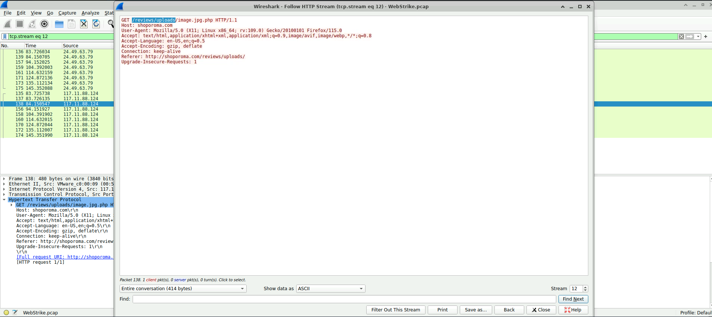

# WebStrike Challenge – Incident Investigation Report

**Platform:** LetsDefend.io  
**Challenge Type:** WebStrike (PCAP-Based Investigation)  
**Role:** SOC Analyst (Student / Trainee)  
**Status:** Completed  

---

## a) WebStrike Challenge

---

## i) Study and Analyze the Given Web-Based Attack Scenario

A suspicious file was detected on a company’s publicly accessible web server, raising concerns of a possible web application compromise. The Development team identified the anomaly and escalated it to the Security team for investigation.

To determine how the file appeared and assess the extent of unauthorized activity, the Network team captured relevant **network traffic** and provided a **PCAP file** for analysis. The investigation focused on identifying malicious HTTP activity, determining the attacker’s entry point, and validating whether post-exploitation actions occurred.

This scenario represents a real-world **web-based attack**, where insecure application functionality can be abused to gain unauthorized access to a server.

---

## ii) Identification of Attack Vectors, Payloads, and Vulnerabilities Exploited

### Attack Vector
- Exploitation of an insecure **file upload functionality**
- Malicious HTTP `POST` request sent to an upload endpoint

### Payload
- PHP web shell uploaded using a **double file extension**:
  ```
  image.jpg.php
  ```
- Embedded reverse shell payload attempting outbound communication to the attacker

### Vulnerability Exploited
- **Unrestricted File Upload**
  - No file extension validation
  - No MIME-type enforcement
  - PHP execution enabled in the upload directory

This vulnerability resulted in **Remote Code Execution (RCE)** capability on the server.

---

## iii) Process of Identifying, Analyzing, and Mitigating the Attack

### Identification
- PCAP analysis revealed repeated HTTP requests from a single external IP address:
  ```
  117.11.88.124
  ```
- A suspicious HTTP `POST` request confirmed successful file upload


---

### Analysis
- Followed HTTP streams to reconstruct attacker activity
- Identified malicious PHP code embedded within the uploaded file
- Observed post-exploitation attempts including reverse shell activity and system file access

  


---

### Mitigation
- Removed the malicious uploaded file
- Blocked the attacker’s source IP address
- Disabled PHP execution in upload directories
- Recommended secure file upload handling, strict validation, and WAF deployment

---

## iv) Screenshots of Investigation and Resolution

The following screenshots were captured as evidence during the investigation:


- IP reputation and geolocation  
  

- HTTP traffic analysis  
  

- Reverse shell and post-exploitation activity  
    
  

---

## Final Verdict

- **Incident Type:** Web Application Attack  
- **Classification:** True Positive  
- **Attack Vector:** Malicious File Upload  
- **Impact:** Attempted Remote Code Execution  

---

## Conclusion

The WebStrike investigation confirmed that the suspicious file was introduced through a **malicious file upload attack** exploiting weak server-side validation. PCAP analysis provided clear evidence of exploitation attempts, attacker behavior, and post-exploitation activity.

This challenge strengthened practical SOC skills in **PCAP analysis, web attack detection, and incident response**.

---

## Notes
- All findings are based strictly on PCAP evidence  
- No assumptions or fabricated data were used  
- Screenshots are included as supporting investigation proof  